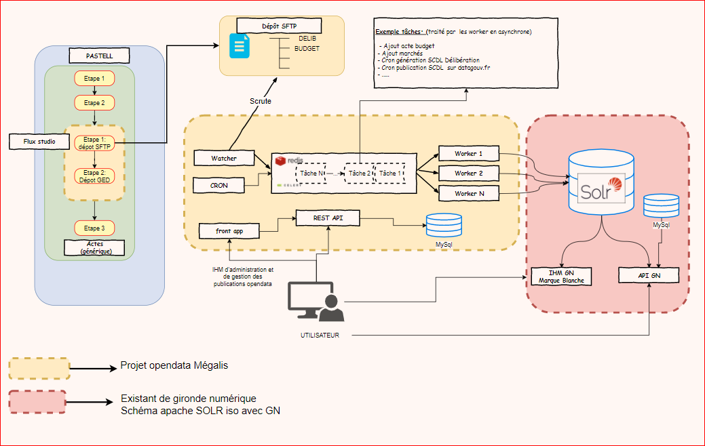
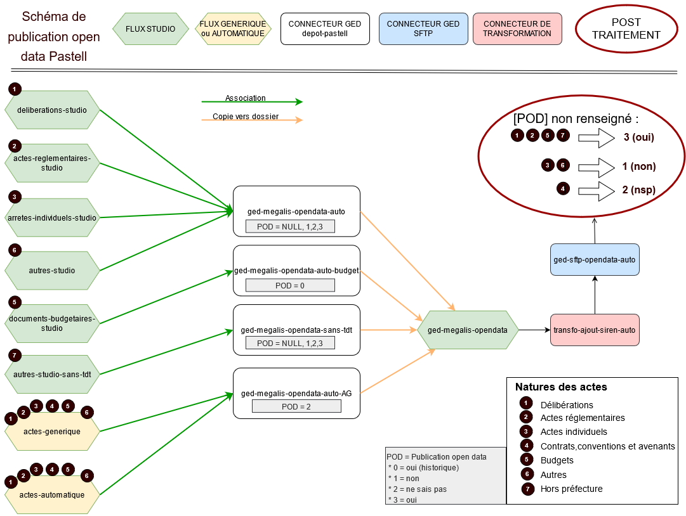

# Présentation du projet

## Résumé
Le but du projet est d'automatiser la publication et la gestion de différents jeux de données en open data depuis la plateforme de services de Mégalis Bretagne.

Il permet la génération et la publication des jeux de données suivants:
* les délibérations ([fichier annuel au format SCDL délibération](https://schema.data.gouv.fr/scdl/deliberations/2.1.3/documentation.html)  et fichier PDF sur marque blanche)
* les budgets ([fichier annuel au format SCDL budget](https://schema.data.gouv.fr/scdl/budget/0.8.1/documentation.html) et fichier PDF sur marque blanche)
* les marchés publics ([fichier annuel format-commande-publique](https://github.com/139bercy/format-commande-publique))

Une interface (IHM) dédiée permet aux utilisateurs de gérer leurs publications et des APIs sont également disponibles pour automatiser différentes actions.

Enfin, deux marques blanches sont disponibles. Une permettant de consulter les actes publiés et une autre pour une consultation des données budgétaires sous format graphique.

Ces deux marques blanches sont intégrable sur un site de collectivité via une iframe. Le projet `opendata-frontapp` dispose d'une interface d'administration pour la réutilisation de ces marques blanches.

## Schéma d'architecture

## Schéma d'architecture Pastell

## Les projets

### Projet : opendata-extraction
L'application permet de gérer les publications opendata de Megalis Bretagne.

En fonction du mode de lancement l'application:
- Expose une API REST (mode runserver)
- Déclenche des tâches périodiques (mode beat)
- Exécute des tâches (mode worker)
- Scrute un répertoire (mode watcher)

Repo : https://github.com/megalis-bretagne/opendata-extraction.git

**Les Technologies utilisées**
* Python 3.9
* Flask
* Celery
* SQLAlchemy
* Apache Solr
* Mysql

### Projet : opendata-frontapp
IHM de gestion des publications à disposition des utilisateurs du service.

Cet IHM comprend aussi une interface d'administration pour utiliser les marques blanches disponibles.
La marque blanche des données budgétaires est aussi disponible via cette application.

Repo : https://github.com/megalis-bretagne/opendata-frontapp.git

**Les Technologies utilisées**
* Angular 11
* Angular Material
* NGRX

### Projet : marque blanche des actes

Projet qui sert l'interface de consultation des actes publiés.

Repo: https://github.com/megalis-bretagne/mq-actes

